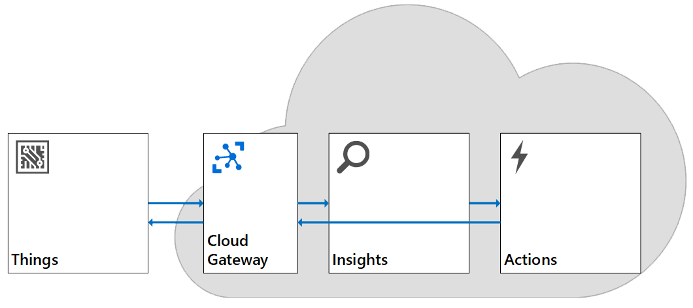
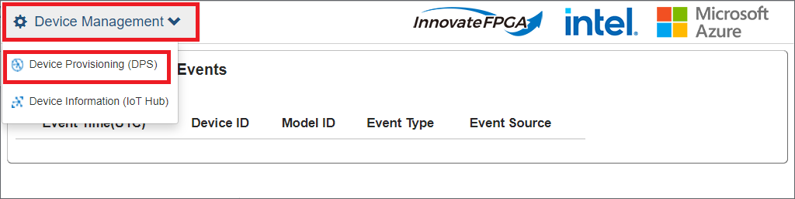
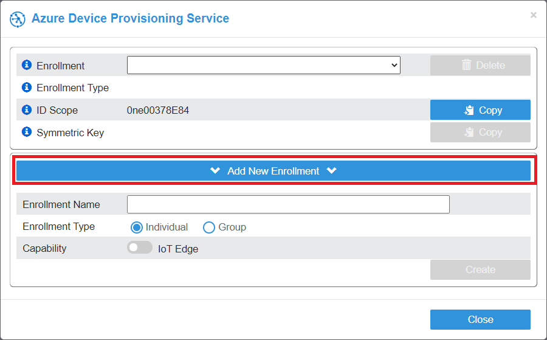
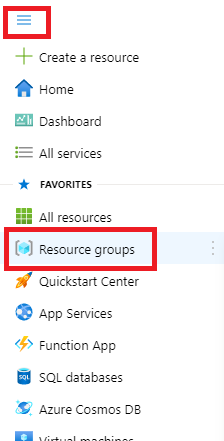
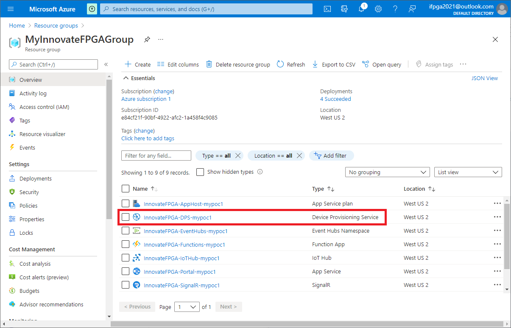
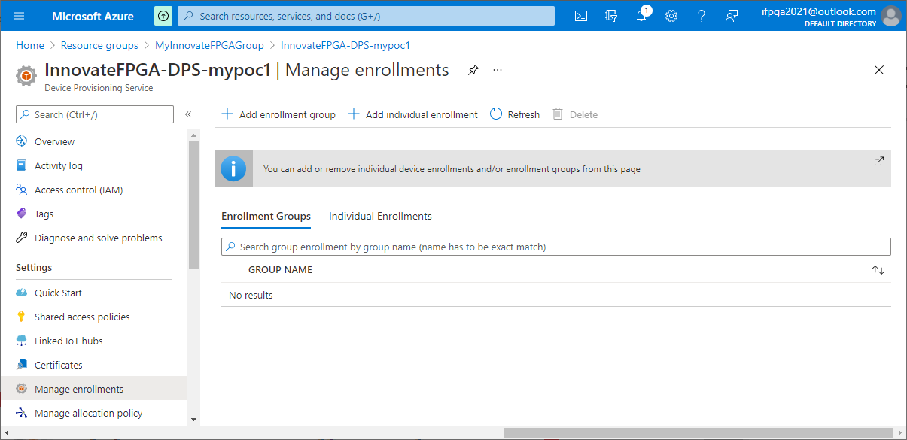

# A demo IoT solution to connect DE10-Nano to Azure IoT : Technical Deep Dive

<< Work in Progress>>

## IoT Solution Pattern

Typical IoT Solutions have 4 building blocks :



- Things  

    Sensors and gateways. Often called devices, edge.  DE10-Nano Cloud Connectivity Kit is an edge device with sensor.  It also act as a gateway.

- Cloud Gateway  

    Entry point to Azure cloud.  Azure IoT Hub is used in many solutions.  DE10-Nano Cloud Connectivity Kit connects to Azure IoT Hub to send telemetry.

- Insights

    Sensors and gateways sends data to cloud application through Cloud Gateway.  Data is ingested, processed, and analyzed to create business value.  For examples, temperature data of an engine is sent from a sensor, a cloud application monitors temperature of the engine.  When the temperature stays too high, the cloud application determines `Critical Condition`.

    Sending data to cloud may take time and can be costly.  You may run `Insights`, or process data at edge to reduce latency/delay.  Azure IoT Edge provides application runtime to bring computing logic down to the edge.

- Action  

    Based on insight, the cloud application takes an action.  For example, sending a text message to notify driver that the engine is overheating.  
    Action can also be taken at the edge.  For example, a gateway may send alert/command to the engine to shutdown to prevent overheat.

## Domains in the solution

The sample IoT solution is consist of multiple technology domains.

- Security domain 

    Typically solutions requires multiple security aspects.  To keep the sample solution simple, the sample solution implements minimum security.  

    - Device Authentication via DPS and IoT Hub.
    - No user authentication.
    - Azure IoT Services are protected via connection strings or keys

    > [!IMPORTANT]  
    > If you plan to make the web site available, consider adding Azure Active Directory (AAD) based Role Based Access Control (RBAC) to the web app.  
    >  
    > <https://docs.microsoft.com/azure/azure-app-configuration/concept-enable-rbac>

- Business and Industrial domain

    Solutions are typically designed and built for a specific use cases.  Business requirements as well as industrial requirements determines additional requirements to be implemented.  For example, monitoring engine's temperature for tracks and factory machineries may have different set of requirements.  The sample solution does not implement specific business nor industrial requirements to keep generic enough as a template.  Consider adding business or industrial requirements to your solution for your use case.  For example, requirements for animal tracking/monitoring solution may be very different from energy conservation solution.

- Device Management domain

    In order for a cloud application to ingest data from devices, devices must be provisioned and connected to cloud.  A solution may require updating device firmware/device application.  For example, solution administrators need to :  

    - Connect only devices that is known and trusted
    - Monitor and manage devices remoetely
    - Capable of disconnecting devices if they are tampered

    The sample solution implements device provisioning through Azure Device Provisioning Service (DPS) using Symmetric Key with Individual Enrollment.  For broader provisioning (e.g. provision hundreds of devices), you may want to consider using X.509 certificate with Group Enrollment.  DPS works closely with IoT Hub to register and allow connection to IoT Hub.

- IoT Data domain

    For an IoT solution to create business value, data must be made available to cloud application(s).  This domain covers how communication between `Things` and `Cloud Application` through Cloud Gateway.  This domain determines how data flows into cloud, then distributed to IoT application.  

- Application domain

    Once data is made available in cloud, a cloud application processes data. This domain is where you make value from data, which is usually determined by :

    - Business problem to be solved
    - Requirements from use cases, business, and/or industry

    For example, a super simple use case (or business problem) may be "how do I visualize large amount of data?".  Visualizing millions of data points with a personal computer may take very long time, however, cloud can provide enough computing power to draw charts and graphs for millions of data points.

    The sample solution simply displays data from the device in real-time.  To keep the solution simple (and be cost effective), it does not store data.


## IoT Device and Data domain

The core of IoT Solution is provisioning, connecting, and interacting with IoT devices.  IoT Devices (DE10-Nano) sends data as well as accepts settings (Threshold) from Cloud.  Depending on your use cases, you may want to model more functionalities so you can send command from your solution, or trigger alerts based on the computation results from FPGA.

IoT Plug and Play provides a language to define device interaction model.

In typical IoT use cases involves following steps :

- Provision device
- Connect device
- Accept incoming data (Data Ingestion)
- Process data
- Take action

## Provision Device

Before you connect your DE10-Nano to the solution, you must prepare the device.  Device provisioning involves :

- Registering device to the solution
- Configure device authentication mechanism
- Configure the device with required settings

Provisioning IoT devices is similar to registering your smartphone to your carrier.  Your phone must be known to the carrier network, associated with your contracts, enabled/disabled features based on your contract, and unique phone number must be assigned.  These information may be programmed in your phone or through SIM card.  In the backend, your carrier manages contract information, phone number etc.

Device Provisioning Service (DPS) provides functionalities to provision your IoT devices to your IoT solution.  DPS uses `enrollment` information to identify the device, authenticate, then assign to the right Azure IoT Hub.

In the sample solution portal, you can manage enrollment with :

1. Click `Device Management` menu, then click `Device Provisioning (DPS)`

    

1. Click `Add New Enrollment`

    

1. Enter `Enrollment Name`
1. Select Individual or Group enrollment  

    If you are planning to provision a single device, select `Individual`.  If you are provisioning multiple devices, select `Group` to manage as a group or create multiple `Individual` enrollments.

1. Turn on `IoT Edge` if you are provisioning Azure IoT Edge device

In Azure Portal, you can manage enrollments with :

1. Navigate to <https://portal.azure.com> and sign in with your Microsoft account.
1. Select `Resource groups` from the menu, then select your resource group  

    

1. Select `Device Provisioning Service` instance from the list  

    

1. Select `Manage Enrollments`  

    

Learn more about managing enrollments : <https://docs.microsoft.com/azure/iot-dps/how-to-manage-enrollments>

## Connect Device

Once your device is provisioned, the device can now connect to Azure IoT Hub.  Azure IoT Hub act as a gateway between Cloud (Azure) and public internet.  IoT Hub provides bi-directional communication over MQTT protocol for secure communication.  

In order to connect DE10-Nano to IoT Hub, the device firmware/app must provide credential information to DPS.  The sample application supports `Symmetric Key` authentication.

More on symmetric key attestation : <https://docs.microsoft.com/azure/iot-dps/concepts-symmetric-key-attestation?tabs=linux>

In order to provision with DPS, the device app must provide 3 pieces of information :  

1. [ID Scope](https://docs.microsoft.com/azure/iot-dps/concepts-service#id-scope)
1. [Enrollment Name](https://docs.microsoft.com/azure/iot-dps/concepts-service#registration-id) (a.k.a. Registration ID)
1. [Symmetric Key](https://docs.microsoft.com/azure/iot-dps/concepts-symmetric-key-attestation?tabs=linux)

In the sample solution, you can retrieve above information.  Use `Copy` buttons to copy ID Scope and Symmetric Key.  

The reference device application takes these information through environment settings.  Set these variables with :

```bash
export IOTHUB_DEVICE_SECURITY_TYPE="DPS"
export IOTHUB_DEVICE_DPS_ENDPOINT="global.azure-devices-provisioning.net"
export IOTHUB_DEVICE_DPS_DEVICE_ID=<Enrollment Name>
export IOTHUB_DEVICE_DPS_ID_SCOPE=<ID Scope>
export IOTHUB_DEVICE_DPS_DEVICE_KEY=<Symmetric Key>
```

## IoT Data

The device can send data such as Sensor data from RFS, as well as receive data from Cloud.  Upstream data is often called Device to Cloud messages (D2C).  Downstream data has 3 types.  1) Cloud to Device message (C2D), 2) Device Twin, and 3) Device Command (or method).

Device Twin is used to communicate settings from Cloud to devices, which is called `Desired Property`, or `Writable Property` in Digital Twin/IoT Plug and PLay world.  Device Twin can also be used to communicate properties of the device to cloud, which is called `Reported Property`, or `Property` in Digital Twin/IoT Plug and Play world.  IoT Hub provides storage space for each device so that these settings are not lost.  The communication is asynchronous way.

Sometimes Cloud needs to communicate with the device and needs to ensure the communication is received.  This type of activities require `synchronous` communication.  In other words, the sender (Cloud application) sends data, and the receiver (device) must respond.  The requester needs to know if the receiver received data, and processed it or not.  This communication can be achieved using Device Method, or Command in Digital Twin/IoT Plug and Play world.

### Ingesting Data

DE10-Nano reference application sends telemetry with Sensor Data every 2 seconds.  

## Processing Data

## Taking action

## Next Step

- [Back to README](README.md)
