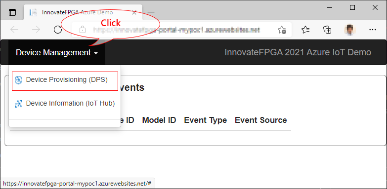
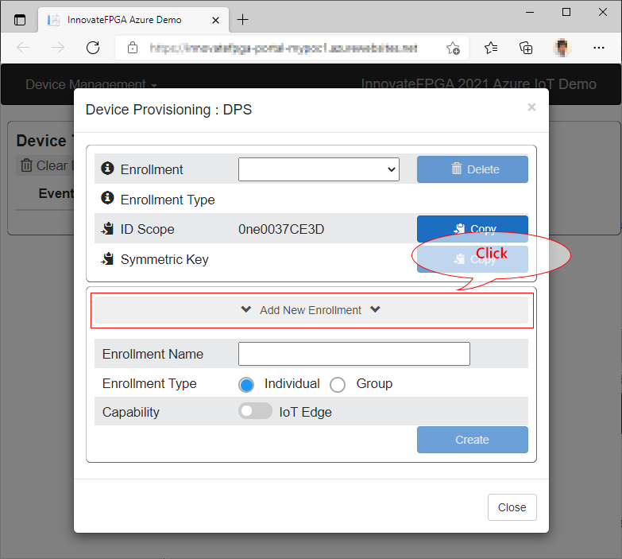
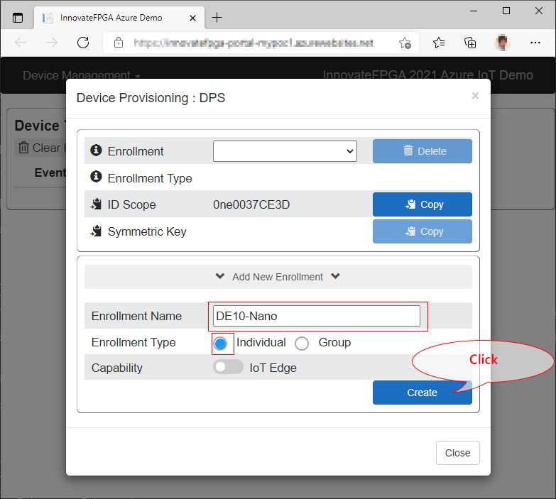
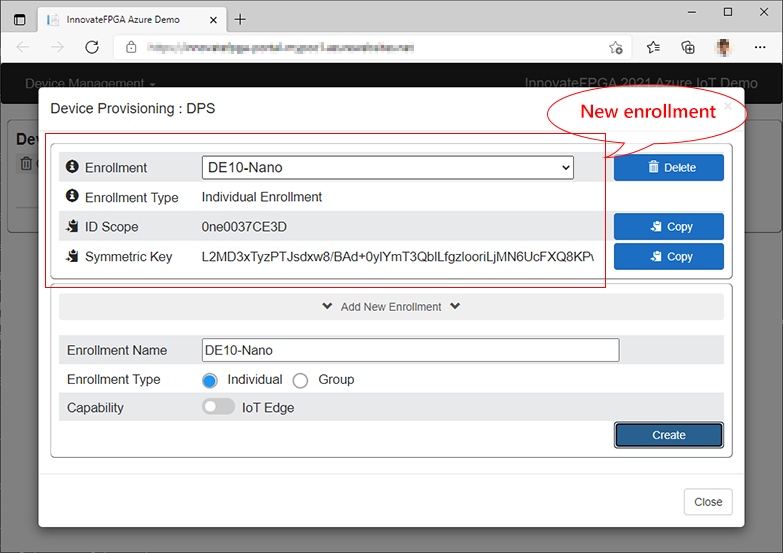
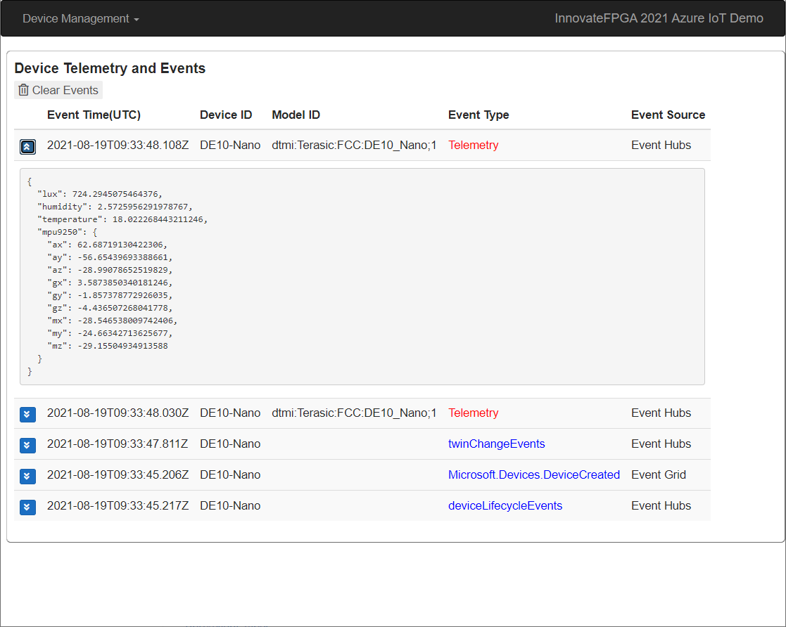

# Connecting DE10-Nano to your IoT Solution

<< Draft : Ready for review>>

In order to connect your DE10-Nano to Azure IoT Hub, you must provision your DE10-Nano.  Provisioning is done through Device Provisioning Service (DPS).
Once your DE10-Nano is provisioned, it can connect to IoT Hub.  Steps involved in connecting DE10-Nano are :

1. Create DPS Enrollment for DE10-Nano
1. Configure your DE10-Nano with DPS provisioning information
1. Run reference device application

## 1. Create DPS Enrollment

An [enrollment](https://docs.microsoft.com/azure/iot-dps/concepts-service#enrollment) is a way to register your DE10-Nano to your IoT solution.  With DPS, your DE10-Nano can auto-provision to IoT Hub.

1. Navigate to your InnovateFPGA Azure Demo web site
1. Click `Device Management` menu in the navigation bar  
1. Click `Device Provisioning (DPS)`

    

1. Click `Add New Enrollment` to expand menu

    

1. Provide enrollment information  

    |Setting  |Description  |Example  |
    |---------|---------|---------|
    |Enrollment Name     | Name of new enrollment.  This name becomes Device ID in IoT Hub. | DE10-Nano      |
    |Enrollment Type    | Enrollment can be individual or group.  Group enrollment is used when you are provisioning more than 1 devices to IoT solution.  Select individual.   | Individual.         |
    |Capability     | If you are running Azure IoT Edge module, enable IoT Edge.  In this instruction, we will use Python App.         |         |

    

1. Click `Create` to create a new individual enrollment

    You should see a new enrollment in the list box above.

    

## 2. Configure your DE10-Nano with DPS provisioning information

In order to provision your DE10-Nano through DPS, the device application requires following information.  

| Information     | Description  | Example     |
|-----------------|--------------|-------------|
| Registration ID | Name of the enrollment.  By default, Registration ID is used as Device ID in IoT Hub. | DE10-Nano   |
| ID Scope        | ID Scope is an identifier of your DPS instance.  With ID Scope, device application can communicate to your DPS instance.  | 0ne00123456 |
| Symmetric Key   | DPS support 3 authentication method, or [Attestation Mechanisms](https://docs.microsoft.com/azure/iot-dps/concepts-service#attestation-mechanism).  1) Symmetric Key, 2) X.509, and 3) TPM.  This IoT solution is configured to use Symmetric Key. |             |

You can pass these information through environment variables to Intel's reference device application.

Click `Copy` buttons for each item and set environment variables.

Example :

```bash
export IOTHUB_DEVICE_SECURITY_TYPE='DPS'
export IOTHUB_DEVICE_DPS_ID_SCOPE='0ne0037CE3D'
export IOTHUB_DEVICE_DPS_DEVICE_ID='DE10-Nano'
export IOTHUB_DEVICE_DPS_DEVICE_KEY='L2MD3xTyzPTJsdxw8/BAd+0ylYmT3QblLfgzlooriLjMN6UcFXQ8KPw/zTACdQhNE/uxWmHFzixcsDhhX5A2KdfdafdQ=='
```

If you are provisioning DE10-Nano as Azure IoT Edge device, please follow this instruction to edit `/etc/aziot/config.toml` file.

<https://docs.microsoft.com/azure/iot-edge/how-to-install-iot-edge?view=iotedge-2020-11>

Authenticate with symmetric keys : <https://docs.microsoft.com/azure/iot-edge/how-to-auto-provision-symmetric-keys?view=iotedge-2020-11&tabs=linux#configure-the-device-with-provisioning-information>

## 3. Run reference device application

Execute main.py in DE10-Nano with :

```bash
python3.7 main.py
```

Once your DE10-Nano is provisioned and connected, you should see device events such as device created and connected, as well as Telemetry from your DE10-Nano.



> [!TIP]  
> You can see details of events and telemetry by clicking the blue button on the left of each row.

Learn more about Device Events from IoT Hub : <https://docs.microsoft.com/en-us/azure/iot-hub/iot-hub-event-grid#event-types>

## Completed

Congratulations.  You are now connect to IoT Hub and you can visualize device events from IoT Hub and telemetry from your DE10-Nano.

## Next Step

- Connecting IoT Edge module to sample IoT solution : TBD : reference to Kawai-san's documentation?
- [Deep Dive on sample IoT solution](PaaS-DeepDive.md)
- [Back to README](README.md)
