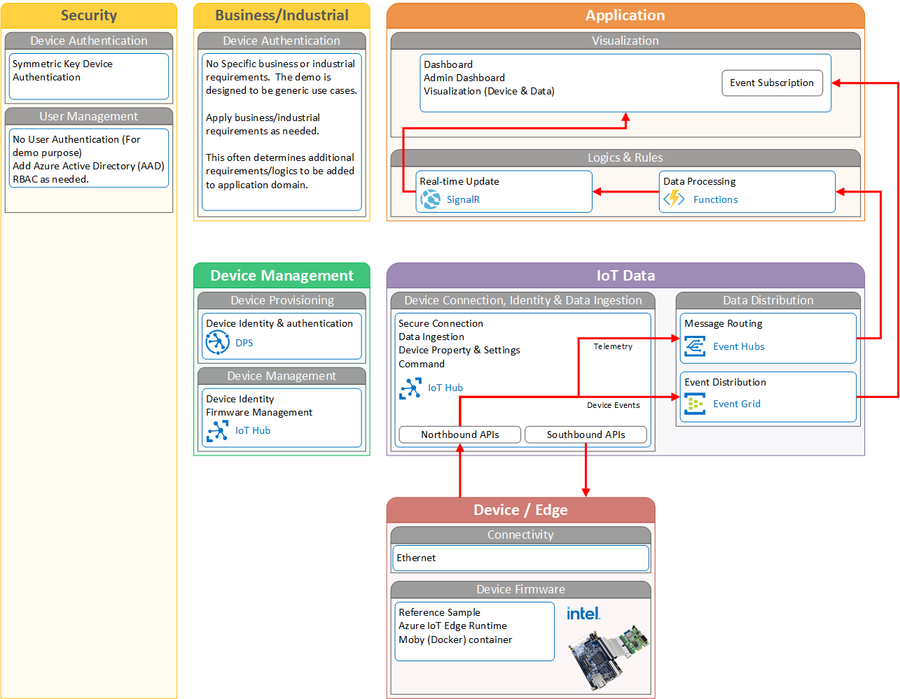

# A demo IoT solution to connect FCC to Azure IoT : Technical Deep Dive

<< Work in Progress>>

## Domains in the solution

This solution is consist of 3 domains.

- IoT Device and Data
- Application
- Device Management

<< To do : Add descriptions/explanations >>

<< To do : Update diagram >>

## IoT Device and Data domain

The core of IoT Solution is provisioning, connecting, and interacting with IoT devices.  IoT Devices (DE10-Nano) sends data as well as accepts settings (Threshold) from Cloud.  Depending on your use cases, you may want to model more functionalities so you can send command from your solution, or trigger alerts based on the computation results from FPGA.

IoT Plug and Play provides a language to define device interaction model.

In typical IoT use cases involves following steps :

- Provision device
- Connect device
- Accept incoming data (Data Ingestion)
- Process data
- Take action

### Provision Device

Before you connect your DE10-Nano to the solution, you must prepare the device.  Device provisioning involves :

- Registering device to the solution
- Configure device authentication mechanism
- Configure the device with required settings

Provisioning IoT devices is similar to registering your smartphone to your carrier.  Your phone must be known to the carrier network, associated with your contracts, enabled/disabled features based on your contract, and unique phone number must be assigned.  These information may be programmed in your phone or through SIM card.  In the backend, your carrier manages contract information, phone number etc.

Device Provisioning Service (DPS) provides functionalities to provision your IoT devices to your IoT solution.  DPS uses `enrollment` information to identify the device, authenticate, then assign to the right Azure IoT Hub.

### Connect Device

Once your device is provisioned, the device can now connect to Azure IoT Hub.  Azure IoT Hub act as a gateway between Cloud (Azure) and public internet.  IoT Hub provides bi-directional communication over MQTT protocol for secure communication.  The device can send data such as Sensor data from RFS, as well as receive data from Cloud.  Upstream data is often called Device to Cloud messages (D2C).  Downstream data has 3 types.  1) Cloud to Device message (C2D), 2) Device Twin, and 3) Device Command (or method).

Device Twin is used to communicate settings from Cloud to devices, which is called `Desired Property`, or `Writable Property` in Digital Twin/IoT Plug and PLay world.  Device Twin can also be used to communicate properties of the device to cloud, which is called `Reported Property`, or `Property` in Digital Twin/IoT Plug and Play world.  IoT Hub provides storage space for each device so that these settings are not lost.  The communication is asynchronous way.

Sometimes Cloud needs to communicate with the device and needs to ensure the communication is received.  This type of activities require `synchronous` communication.  In other words, the sender (Cloud application) sends data, and the receiver (device) must respond.  The requester needs to know if the receiver received data, and processed it or not.  This communication can be achieved using Device Method, or Command in Digital Twin/IoT Plug and Play world.

## Next Step

- [Back to README](README.md)
