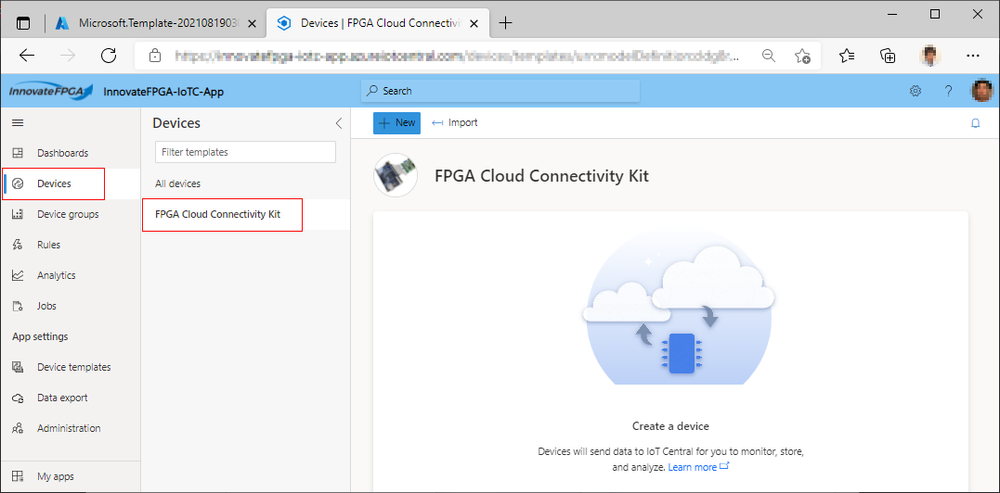
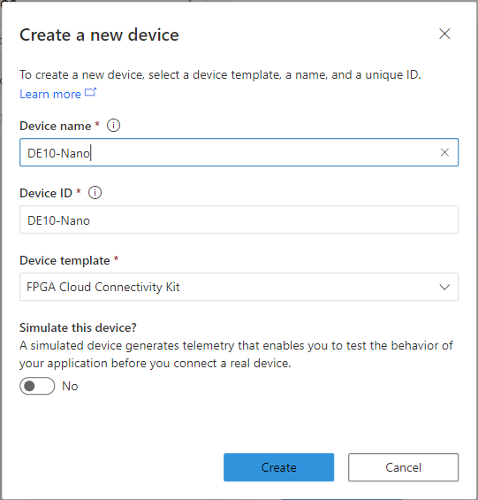
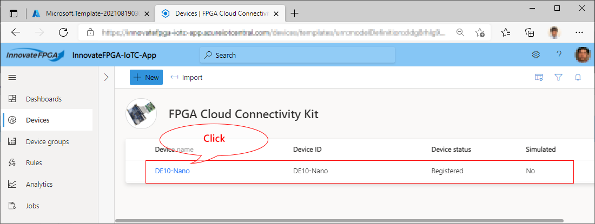
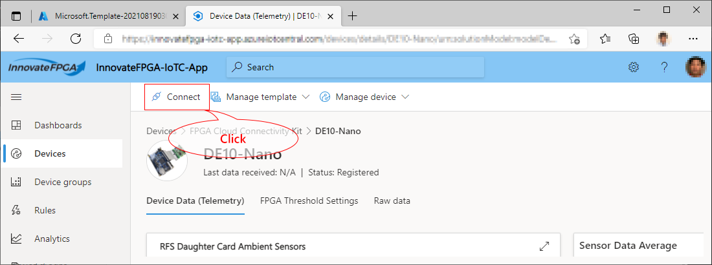
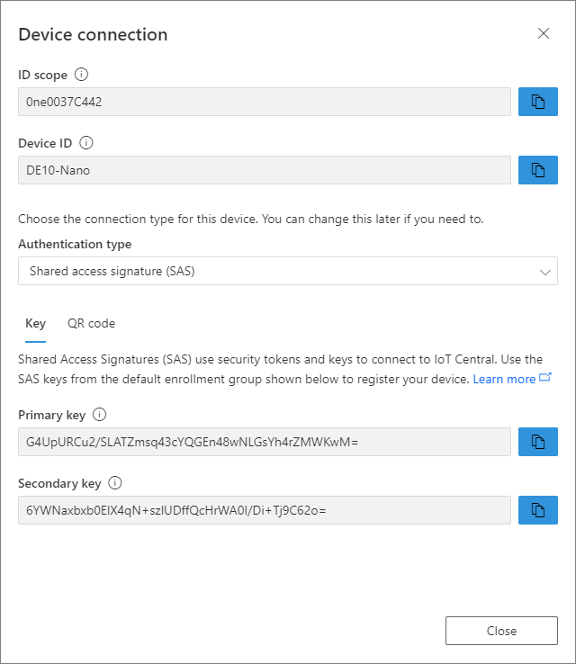
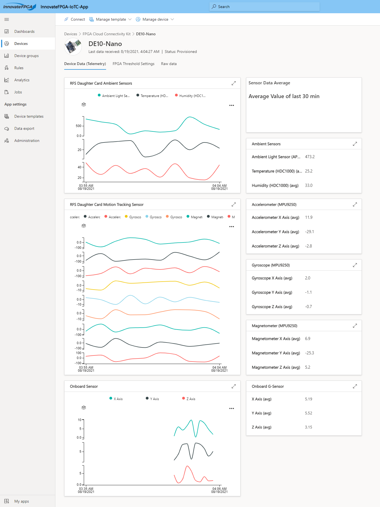

# Connecting DE10-Nano to your IoT Central Application

<< Draft : Ready for review>>

In order to connect your DE10-Nano to Azure IoT Hub, you must provision your DE10-Nano.  Provisioning is done through Device Provisioning Service (DPS).
Once your DE10-Nano is provisioned, it can connect to IoT Hub.  Steps involved in connecting DE10-Nano are :

1. Create a device instance (or Device ID) for your DE10-Nano
1. Configure your DE10-Nano with DPS provisioning information
1. Run reference device application

## 1. Generate Device Key for your DE10-Nano

Your IoT Central application is pre-configured for DE10-Nano, using IoT Plug and Play Device Model.  We will create a new device identity in IoT Central application.

1. Navigate to your IoT Central Application
1. Navigate to `Devices` page  

  Click `Devices`, then click `FPGA Cloud Connectivity Kit`

  

1. Create a new device

  Enter `Device name` and `Device ID` (they can be same), then select `FPGA Cloud Connectivity Kit` from the list for Device Template.  
  Click `Create` to create a new device for your DE10-Nano.

  |Setting  |Description  |Example  |
  |---------|---------|---------|
  |Device Name     | End user friendly name appears in UI        | DE10-Nano         |
  |Device ID     | Device Identity used for connection           | DE10-Nano         |
  |Device Template     | Select FPGA Cloud Connectivity Kit         |         |
  |Simlate this device?     | If you do not have a device, IoT Central can simulate device telemetry etc.  Select `No` since you are connecting real device.         |         |

  

1. Confirm you have a new device for your DE10-Nano

  

  > [!NOTE]  
  > Device is in `Registered` state.

1. Click on Device Name to open device's detail page, then click `Connect`  

  

1. You can see information to provision your DE10-Nano to IoT Central application  

  

## 2. Configure your DE10-Nano with DPS provisioning information

In order to provision your DE10-Nano through DPS, the device application requires following information.

| Information     | Description  | Example     |
|-----------------|--------------|-------------|
| ID Scope        | ID Scope is an identifier of your DPS instance.  With ID Scope, device application can communicate to your DPS instance.  | 0ne00123456 |
| Device ID | Name of the enrollment.  By default, Registration ID is used as Device ID in IoT Hub. | DE10-Nano   |
| Key   | Take either Primary Key or Secondary Key to provision your DE10-Nano. |             |

You can pass these information through environment variables to Intel's reference device application.

Click `Copy` buttons for each item and set environment variables.

Example :

```bash
export IOTHUB_DEVICE_SECURITY_TYPE='DPS'
export IOTHUB_DEVICE_DPS_ID_SCOPE='0ne0037C442'
export IOTHUB_DEVICE_DPS_DEVICE_ID='DE10-Nano'
export IOTHUB_DEVICE_DPS_DEVICE_KEY='G4UpURCu2/SLATZmsq43cYQGEn48wNLGsYh4rZMWKwM='
```

## 3. Run reference device application

Execute main.py in DE10-Nano with :

```bash
python3.7 main.py
```

Once your DE10-Nano is provisioned and connected, you should see device status change to `Provisioned` status.  You can also see telemetry from your DE10-Nano.


Wait for a minute or so, you should start seeing telemetry data in `Device Data` page.



## Completed

Congratulations.  You are now connect to IoT Hub and you can visualize device events from IoT Hub and telemetry from your DE10-Nano.

## Next Step

- Connecting IoT Edge module to sample IoT solution : TBD : reference to Kawai-san's documentation?
- [Back to README](README.md)
